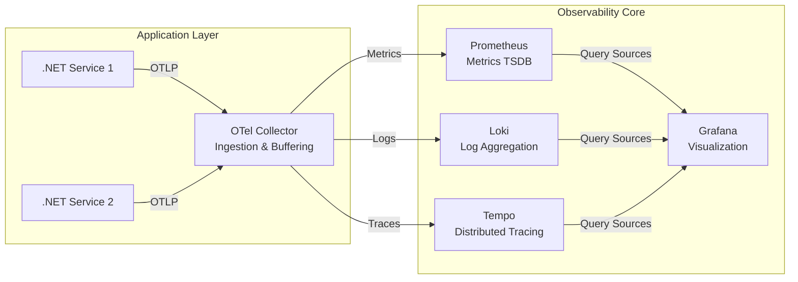

# .NET Observability Stack

A production-grade, lightweight observability stack designed for .NET applications using OpenTelemetry. Built on Docker Compose, this stack provides distributed tracing, structured logging, and metrics visualization at a fraction of the cost of cloud-native alternatives like Azure Application Insights or Datadog.

## 🏗️ Architecture



## 📦 Components

| Service | Purpose | Default Port |
| :--- | :--- | :--- |
| **Prometheus** | Stores time-series metrics (CPU, Memory, HTTP latency). | `9090` |
| **Loki** | Collects and indexes log streams. Highly cost-effective. | `3100` |
| **Tempo** | Grafana's native distributed tracing backend. | `3200` (HTTP), `4317` (gRPC) |
| **Grafana** | Unified dashboarding, log browsing, and trace exploration. | `3000` |
| **OTel Collector** | The data plane agent. Receives telemetry via OTLP and forwards it to the correct backend. | `4317` (gRPC), `4318` (HTTP) |

## ⚙️ Resource Limits (Docker Compose)

To prevent OOM (Out of Memory) crashes on constrained VMs (e.g., 2 vCPU / 4GB+ RAM), explicit limits are configured:

| Service | Memory Limit | CPU Limit | Notes |
| :--- | :--- | :--- | :--- |
| **Prometheus** | `2048M` (2 GB) | `1.0` core | The heaviest service; handles query evaluation and TSDB writes. |
| **Loki** | `1024M` (1 GB) | `0.5` cores | Compression-heavy; memory scales with active queries, not total logs. |
| **Grafana** | `512M` (0.5 GB) | `0.5` cores | Lightweight unless running complex multi-datasource dashboards. |
| **Tempo** | `512M` (0.5 GB) | `0.5` cores | Trace data is written directly to disk; minimal RAM usage. |
| **OTel Collector**| `512M` (0.5 GB) | `0.5` cores | Buffer overhead scales with ingestion throughput. |

## 🚀 Quick Start (Local Development)

Prerequisites: [Docker Desktop](https://www.docker.com/products/docker-desktop/) installed and running.

```bash
# Navigate to the stack directory
cd ~/source/otel-stack

# Pull images and start all services in detached mode
docker compose up -d

# Verify status
docker compose ps
```

### Accessing Services
- **Grafana UI:** [http://localhost:3000](http://localhost:3000) (Default: `admin` / `admin`)
- **Prometheus UI:** [http://localhost:9090](http://localhost:9090)
- **Tempo API:** [http://localhost:3200](http://localhost:3200)

## ☁️ Cloud Deployment Guide (Azure / Oracle)

### 1. VM Sizing & Cost Optimization
This stack is extremely lightweight and performs well on smaller instances than you might expect.

| Tier | vCPU | RAM | Est. Monthly Cost (Azure Standard) | Suitability |
| :--- | :--- | :--- | :--- | :--- |
| **Pet Project** | 1 vCPU | 2 GB | ~$15 - $20 | Minimum viable for low-traffic apps (requires swap). |
| **Recommended** | 2 vCPU | 4 GB | ~$30 - $40 | Stable performance with room to grow. |
| **High Capacity**| 4 vCPU | 16 GB+ | ~$80+ | Heavy ingestion, complex alerting rules, or multiple apps. |

**💡 Oracle Cloud Note:** The E2A (ARM) instances offer **4 OCPUs and 24GB RAM completely free**. This stack runs flawlessly on the Always Free tier.

### 2. Storage Configuration
- **Type:** Use **Premium SSD** (Azure Managed Disks). Prometheus relies on fast random writes (WAL); Standard HDDs will cause data loss or severe query delays.
- **Size:** The default **128 GB System Disk** is sufficient. Prometheus is configured to cap disk usage at 2GB (`retention.size`), leaving the rest for OS and Docker images.

### 3. Network & Cost (Azure Specific)
Telemetry costs in Azure are driven by **egress** (data leaving the VM). 
- **Use Private IPs:** Ensure your .NET services send telemetry to the *internal* IP of this stack's OTel Collector port (`4317`/`4318`).
- **Zero Cost Rule:** Intra-region traffic between VMs in Azure using Private IPs is **$0.00**. 
- **Avoid Public Egress:** If your app sends telemetry over a Public IP, you will pay standard egress fees (~$0.10/GB).

### 4. Linux Memory Management (Swap Setup)
Linux aggressively reclaims memory for its page cache, which can starve Docker containers of RAM and cause OOM kills during metric scrapes. **Always add swap to your deployment:**

```bash
# Run as root or with sudo on your target VM
fallocate -l 4G /swapfile
chmod 600 /swapfile
mkswap /swapfile
swapon /swapfile
echo '/swapfile none swap sw 0 0' >> /etc/fstab
```

## 📖 Instrumenting a .NET App

To connect your application to this stack, add the following NuGet packages:
- `OpenTelemetry.Exporter.OpenTelemetryProtocol`
- `OpenTelemetry.Extensions.Hosting`
- `OpenTelemetry.Instrumentation.AspNetCore` (or other relevant instrumentation)

**Program.cs Configuration:**
```csharp
builder.Services.AddOpenTelemetry()
    .WithTracing(t => t.AddOtlpExporter(o => o.Endpoint = "http://otel-collector:4318"))
    .WithMetrics(m => m.AddOtlpExporter(o => o.Endpoint = "http://otel-collector:4318"));
```
*(Note: Replace `otel-collector` with the VM's private IP if running outside a Docker network.)*

## 🛠️ Troubleshooting

- **Prometheus OOMKilled:** If Prometheus is crashing, increase `mem_limit` in `docker-compose.yml` and reduce `scrape_interval` or metric cardinality.
- **Grafana shows "No Data":** Ensure your .NET app is actually generating spans/metrics. Use the OTel Collector's `/debug/zzzprofile` endpoint to verify inbound traffic is being received before it hits Tempo/Prometheus.
- **Disk Full:** Run `docker system prune -a` occasionally, or expand your Azure Managed Disk via the Portal if Prometheus retention limits are increased.
